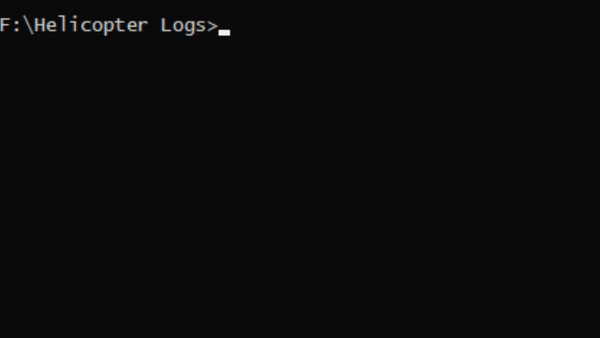

# RS2IPParser

Parse suspicious IPs in Rising Storm 2: Vietnam server logs.

The output log file is in CSV format, where the first column
is the IP and the second column is the number of the matches
for the IP.

Number of matches equals the number of log lines the IP
was seen in the log file.

The script will automatically ignore IPs valid player
information (Steam ID) associated with them.

# Usage Examples

Using the standalone executable (via cmd.exe):
```RS2IPParser.exe Launch.log```



Using Python:
```python parse.py Launch.log```

The script will write output to `Launch.log.csv`, which can then be
opened for example in Microsoft Excel and sorted by number of matches.

# Download

Latest release from [releases](https://github.com/tuokri/RS2IPParser/releases).
